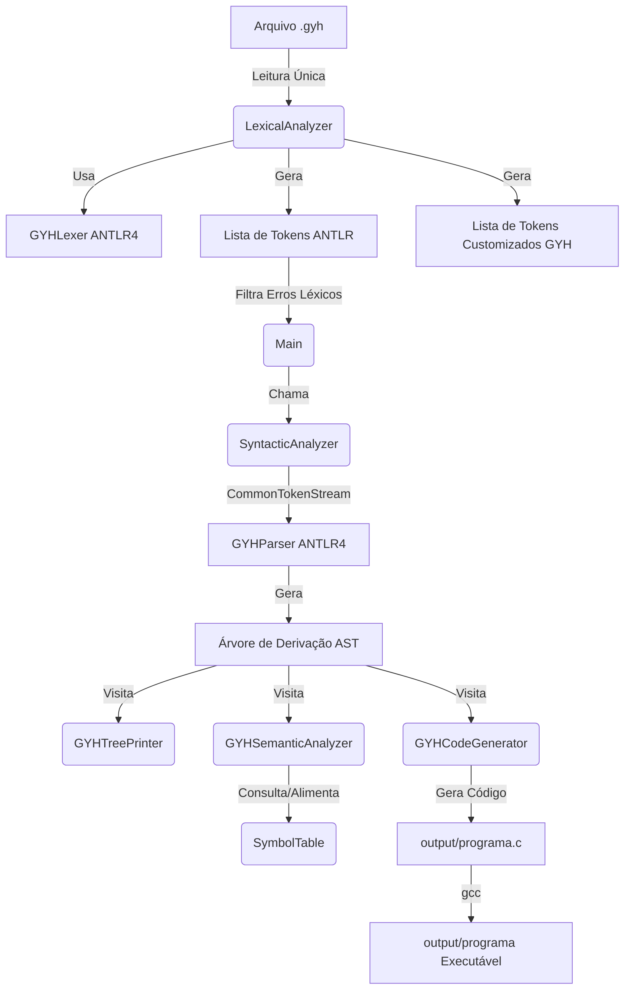
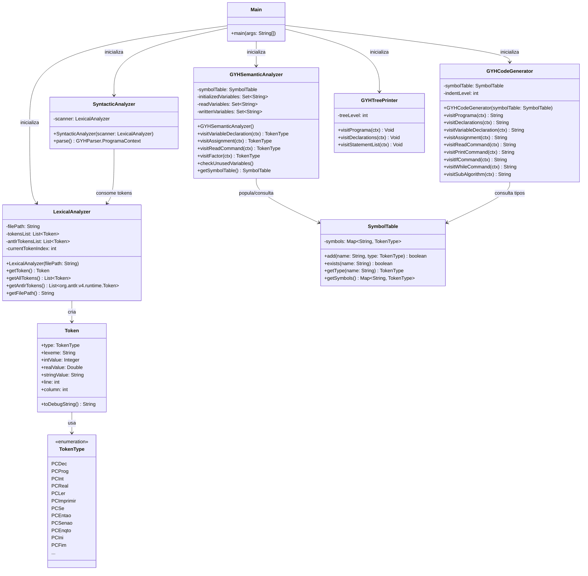

# Compilador GYH

[](https://adoptium.net/)
[](https://maven.apache.org/)
[](https://www.antlr.org/)
[](https://junit.org/junit5/)
[](https://gcc.gnu.org/)

Este repositório contém o compilador completo para a linguagem **GYH**, desenvolvido como projeto prático para a disciplina de **Compiladores**. O compilador executa a análise léxica, sintática, semântica e realiza a **geração de código em C**, com suporte a compilação e execução imediata do binário nativo.

---

## 📋 Sumário

1. [Arquitetura do Compilador](#-arquitetura-do-compilador)
2. [Diagrama de Classes](#-diagrama-de-classes)
3. [Estrutura do Projeto](#-estrutura-do-projeto)
4. [Especificação da Linguagem](#-especificação-da-linguagem)
5. [Análise Semântica (Diferenciais)](#-análise-semântica-diferenciais)
6. [Geração de Código C](#-geração-de-código-c)
7. [Instalação e Uso do Atalho CLI](#-instalação-e-uso-do-atalho-cli)
8. [Como Executar e Testar](#-como-executar-e-testar)

---

## 🏗️ Arquitetura do Compilador

O pipeline do compilador foi construído de forma **modular**. A tokenização (análise léxica) ocorre na primeira fase, gerando uma lista de tokens ANTLR em memória. Essa lista é então transmitida para a análise sintática de leitura única (sem re-leitura física do disco), que constrói a árvore de derivação (AST). Por fim, Visitors de somente leitura percorrem a árvore para validações semânticas e geração de código.



---

## 📊 Diagrama de Classes

Abaixo está a estrutura de classes que compõem o compilador:



---

## 📁 Estrutura do Projeto

O repositório está organizado da seguinte forma:

```text
compilador-gyh/
├── pom.xml                     # Configurações do Maven e dependências (ANTLR 4.7.2 / JUnit 5)
├── gyh                         # Script de atalho para desenvolvimento
├── install.sh                  # Script instalador do compilador no Linux
├── src/
│   ├── main/
│   │   ├── antlr4/
│   │   │   └── gyh/parser/
│   │   │       └── GYH.g4      # Arquivo de Gramática ANTLR4
│   │   └── java/
│   │       └── gyh/
│   │           ├── Main.java              # Classe orquestradora
│   │           ├── LexicalAnalyzer.java   # Wrapper do Lexer ANTLR4
│   │           ├── SyntacticAnalyzer.java # Orquestrador do Parser ANTLR4
│   │           ├── GYHSemanticAnalyzer.java # Análise Semântica (Visitor)
│   │           ├── GYHCodeGenerator.java  # Gerador de Código C (Visitor)
│   │           ├── GYHTreePrinter.java    # Visualizador de árvore sintática (Visitor)
│   │           ├── SymbolTable.java       # Tabela de símbolos
│   │           ├── Token.java             # Objeto de representação do token
│   │           ├── TokenType.java         # Enum dos tipos de token
│   │           └── GYHException.java      # Exceção customizada
│   └── test/
│       └── java/
│           └── gyh/
│               └── LexicalAnalyzerTest.java # Suite de testes unitários do léxico
├── scripts/
│   ├── run_tests.sh            # Script executor da suíte de testes completa
│   ├── run_c_programs.sh       # Script compila e testa binários gerados
│   └── show_off.sh             # Exibição colorida de tokens no terminal
├── tests/
│   └── programs/               # Arquivos fontes em GYH (.gyh) para teste
│       ├── fatorial.gyh        # Fatorial recursivo clássico
│       ├── expressao.gyh       # Expressões matemáticas complexas
│       ├── calculadora.gyh     # Calculadora interativa completa
│       ├── complexo_fibonacci.gyh # Série de Fibonacci
│       ├── complexo_operacoes.gyh # Operações com E/OU booleanos
│       ├── erro_inicializacao.gyh # Erro: uso de variável não inicializada
│       ├── erro_complexo_aninhado.gyh # Erro: não inicialização em blocos
│       ├── erro_complexo_tipo.gyh # Erro: atribuição REAL para INT
│       └── erros.gyh           # Erros léxicos gerais
└── output/                     # Diretório de saída para arquivos .c e binários (gerado automaticamente)
```

---

## 📚 Especificação da Linguagem

A linguagem possui as seguintes palavras-chave em caixa alta e operadores compatíveis:

*   **Palavras-chave:** `DEC`, `PROG`, `INT`, `REAL`, `LER`, `IMPRIMIR`, `SE`, `ENTAO`, `SENAO`, `ENQTO`, `INI`, `FIM`, `E`, `OU`.
*   **Operadores Aritméticos:** `+`, `-`, `*`, `/`.
*   **Operadores Relacionais:** `<`, `<=`, `>`, `>=`, `==`, `!=`.
*   **Atribuição:** `:=`.

---

## 🛡️ Análise Semântica (Diferenciais)

O analisador semântico realiza validações estáticas durante o percurso da AST:
1.  **Redeclaração e Escopo**: Impede declaração duplicada no bloco `:DEC`.
2.  **Verificação de Tipos**: Impede a atribuição direta de valores `REAL` a variáveis do tipo `INT`.
3.  **Inicialização Estática**: Impede o uso de variáveis não inicializadas anteriormente por meio de `:=` ou `LER`.
4.  **Código Morto**: Emite alertas (`[AVISO SEMÂNTICO]`) se variáveis declaradas nunca forem utilizadas.

---

## ⚙️ Geração de Código C

Utilizando o padrão Visitor, o compilador traduz a árvore sintática em um programa correspondente na linguagem C, que é gravado no diretório `output/`.
*   Variáveis `INT` $\rightarrow$ `int`.
*   Variáveis `REAL` $\rightarrow$ `double`.
*   O compilador realiza **inferência de tipo estática em expressões complexas** para selecionar dinamicamente a formatação correta de I/O (`%d` ou `%lf`) em `printf` e `scanf`.
*   Endentação lógica em C é calculada dinamicamente à medida que os nós dos sub-algoritmos são visitados.

---

## 🔌 Instalação e Uso do Atalho CLI

Desenvolvemos um script instalador que empacota o compilador em um executável JAR independente (*fat JAR*) e o instala localmente ou globalmente.

### Como Instalar

1.  **Instalação Local (Usuário corrente - recomendado):**
    ```bash
    ./install.sh
    ```
    *O atalho ficará disponível em `~/.local/bin/gyh`.*

2.  **Instalação Global (Requer privilégios de administrador):**
    ```bash
    ./install.sh --global
    ```

---

### Comandos Disponíveis

Uma vez instalado (e com o atalho configurado no seu PATH), você pode rodar os seguintes comandos em qualquer pasta:

*   **Compilar gerando arquivo `.c` em `output/`:**
    ```bash
    gyh tests/programs/fatorial.gyh
    ```
*   **Compilar gerando o executável binário compilado pelo `gcc`:**
    ```bash
    gyh tests/programs/fatorial.gyh -c
    ```
*   **Compilar e Executar o programa imediatamente de forma interativa:**
    ```bash
    gyh tests/programs/fatorial.gyh -r
    ```
*   **Rodar apenas análise léxica (exibindo os tokens):**
    ```bash
    gyh tests/programs/fatorial.gyh --tokens
    ```
*   **Exibir a mensagem de ajuda:**
    ```bash
    gyh --help
    ```

---

## 🧪 Como Executar e Testar

Se preferir não instalar o comando globalmente, você pode compilar e rodar os testes a partir do repositório local:

### Compilar e Rodar Testes de Integração
O script a seguir executa o build, os testes unitários JUnit do léxico e valida a compilação correta de todos os arquivos de exemplo:
```bash
./scripts/run_tests.sh
```

### Compilar e Rodar os Executáveis C Gerados
O script a seguir compila via `gcc` todos os códigos gerados em `output/`, executa-os simulando entradas válidas e exibe os resultados correspondentes:
```bash
./scripts/run_c_programs.sh
```
