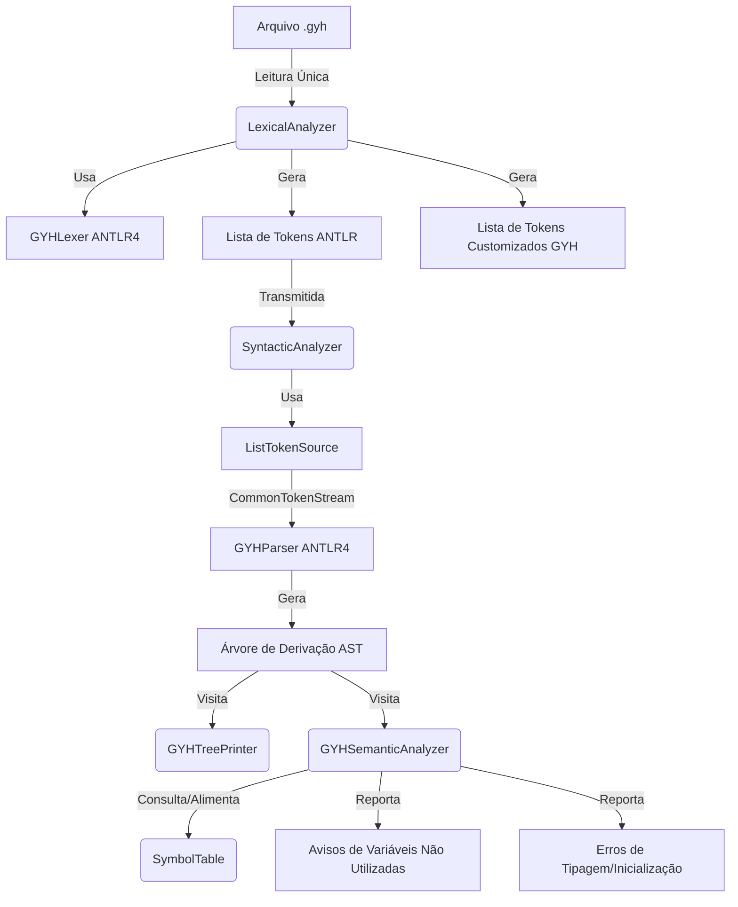
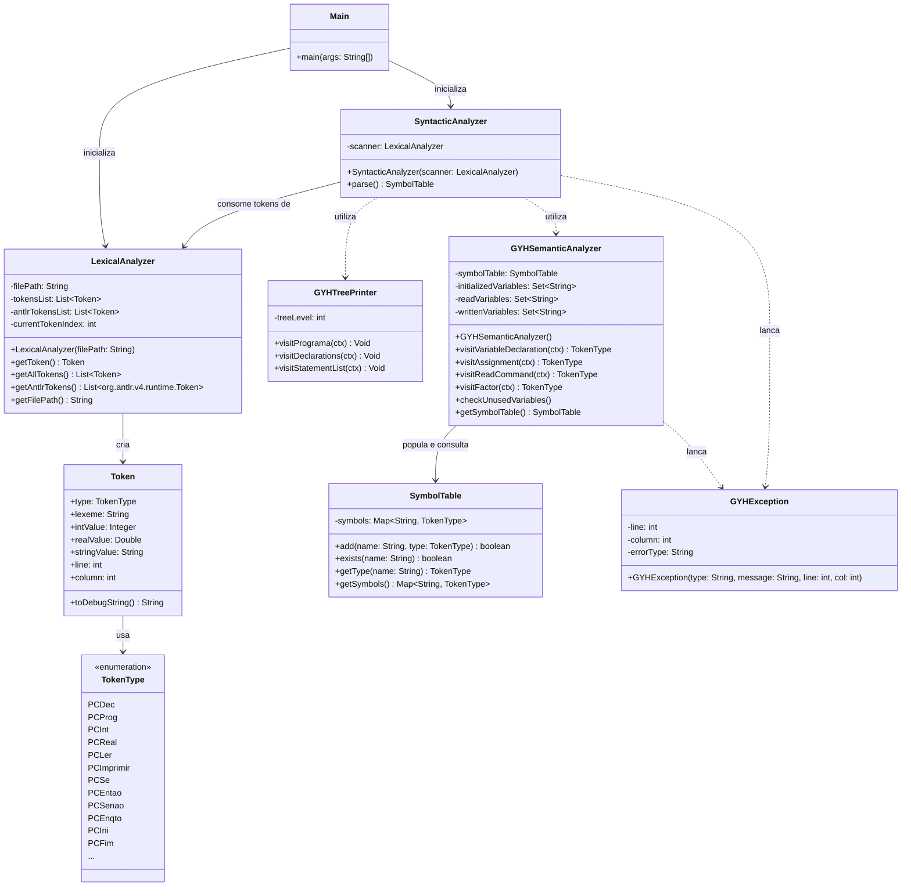

# Compilador GYH

[](https://adoptium.net/)
[](https://maven.apache.org/)
[](https://www.antlr.org/)
[](https://junit.org/junit5/)

Este repositório contém o compilador completo para a linguagem **GYH**, desenvolvido como projeto prático para a disciplina de **Compiladores**. 

A linguagem GYH é uma linguagem de programação procedural simples em português, contendo recursos de declaração de tipos, estruturas de decisão, laços de repetição, além de expressões aritméticas, relacionais e lógicas.

---

## 📋 Sumário

1. [Arquitetura do Compilador](#-arquitetura-do-compilador)
2. [Diagrama de Classes](#-diagrama-de-classes)
3. [Estrutura do Projeto](#-estrutura-do-projeto)
4. [Especificação da Linguagem](#-especificação-da-linguagem)
5. [Análise Semântica (Diferenciais)](#-análise-semântica-diferenciais)
6. [Como Executar](#-como-executar)
7. [Como Testar](#-como-testar)
8. [Demonstração Dinâmica](#-demonstração-dinâmica)

---

## 🏗️ Arquitetura do Compilador

O pipeline do compilador foi construído de forma **modular**. A tokenização (análise léxica) ocorre na primeira fase, gerando uma lista de tokens ANTLR em memória. Essa lista é então transmitida para a análise sintática de leitura única (sem re-leitura física do disco), que constrói a árvore de derivação (AST). Por fim, Visitors de somente leitura percorrem a árvore para validações semânticas e impressão.



---

## 📊 Diagrama de Classes

Abaixo está a estrutura estática das classes que compõem o compilador e suas respectivas relações:



---

## 📁 Estrutura do Projeto

O repositório está organizado segundo a convenção de projetos Java sob o ecossistema Maven:

```text
compilador-gyh/
├── pom.xml                     # Configurações do projeto e dependências do ANTLR4 / JUnit 5
├── src/
│   ├── main/
│   │   ├── antlr4/
│   │   │   └── gyh/parser/
│   │   │       └── GYH.g4      # Arquivo de Gramática ANTLR4 (Tokens + Regras Sintáticas)
│   │   └── java/
│   │       └── gyh/
│   │           ├── Main.java              # Ponto de entrada do compilador
│   │           ├── LexicalAnalyzer.java   # Wrapper do Lexer ANTLR4
│   │           ├── SyntacticAnalyzer.java # Orquestrador do Parser e ListTokenSource
│   │           ├── GYHSemanticAnalyzer.java # Visitor semântico
│   │           ├── GYHTreePrinter.java    # Visitor para impressão da árvore sintática
│   │           ├── SymbolTable.java       # Tabela de símbolos para escopo
│   │           ├── Token.java             # Representação interna do Token
│   │           ├── TokenType.java         # Enum dos tipos de Token
│   │           └── GYHException.java      # Classe customizada de erros do compilador
│   └── test/
│       └── java/
│           └── gyh/
│               └── LexicalAnalyzerTest.java # Suite de Testes Unitários (51 casos de teste)
├── scripts/
│   ├── run_tests.sh            # Script de compilação, testes Maven e execução de exemplos
│   └── show_off.sh             # Script de demonstração formatada da análise léxica
└── tests/
    └── programs/               # Arquivos fontes em GYH (.gyh) para teste
        ├── fatorial.gyh        # Exemplo clássico
        ├── expressao.gyh       # Expressões complexas
        ├── erro_inicializacao.gyh # Teste de detecção de variável não inicializada
        ├── erro_semantico.gyh  # Teste de escopo
        ├── erro_tipo.gyh       # Teste de incompatibilidade de tipos
        └── erros.gyh           # Erros léxicos gerais
```

---

## 📚 Especificação da Linguagem

### Palavras-chave
A linguagem é case-sensitive para as palavras-chave (sempre em caixa alta):

| Palavra | Token | Descrição |
| :--- | :--- | :--- |
| `DEC` | `PCDec` | Cabeçalho de Declaração de Variáveis |
| `PROG` | `PCProg` | Cabeçalho do Programa Principal |
| `INT` | `PCInt` | Tipo de dado Inteiro |
| `REAL` | `PCReal` | Tipo de dado Real (Ponto Flutuante) |
| `LER` | `PCLer` | Comando de entrada de dados |
| `IMPRIMIR` | `PCImprimir` | Comando de saída de dados |
| `SE` | `PCSe` | Início do bloco condicional |
| `ENTAO` | `PCEntao` | Cláusula verdadeira do condicional |
| `SENAO` | `PCSenao` | Cláusula falsa do condicional (opcional) |
| `ENQTO` | `PCEnqto` | Estrutura de repetição condicional |
| `INI` | `PCIni` | Delimitador de início de bloco |
| `FIM` | `PCFim` | Delimitador de fim de bloco / condicional |

### Operadores e Delimitadores

| Símbolo | Token | Tipo |
| :--- | :--- | :--- |
| `+` / `-` | `OpAritSoma` / `OpAritSub` | Operador Aritmético (Aditivo) |
| `*` / `/` | `OpAritMult` / `OpAritDiv` | Operador Aritmético (Multiplicativo) |
| `<` / `<=` | `OpRelMenor` / `OpRelMenorIgual` | Operador Relacional |
| `>` / `>=` | `OpRelMaior` / `OpRelMaiorIgual` | Operador Relacional |
| `==` / `!=` | `OpRelIgual` / `OpRelDif` | Operador Relacional |
| `E` / `OU` | `OpBoolE` / `OpBoolOu` | Operador Lógico/Booleano |
| `:` | `Delim` | Separador de Declarações |
| `:=` | `Atrib` | Atribuição de Valor |
| `(` / `)` | `AbrePar` / `FechaPar` | Agrupamento de Expressões |

---

## 🛡️ Análise Semântica (Diferenciais)

O compilador GYH vai além da análise sintática tradicional, oferecendo recursos de validação estática de código:

1. **Validação de Declarações**: Impede a declaração duplicada da mesma variável no bloco `:DEC` e proíbe a atribuição ou leitura de variáveis não declaradas.
2. **Sistema de Tipos e Coerção**:
   * Proíbe a atribuição direta de valores `REAL` a variáveis do tipo `INT`.
   * Permite a atribuição de valores `INT` a variáveis `REAL` (com coerção implícita).
3. **Verificação de Inicialização Estática**: Lança um erro semântico de compilação se uma variável for utilizada em uma expressão aritmética, lógica ou condicional sem que tenha sido inicializada anteriormente por meio de uma atribuição (`:=`) ou leitura (`LER`).
4. **Detecção de Código Morto (Avisos)**: Emite avisos (`[AVISO SEMÂNTICO]`) se variáveis declaradas nunca forem utilizadas (lidas/escritas) ou se forem apenas escritas mas nunca lidas ao longo do programa principal.

---

## 🚀 Como Executar

O projeto utiliza o Maven para o ciclo de compilação, facilitando a resolução de dependências do ANTLR e JUnit.

### Compilação do Projeto
```bash
# Limpar builds antigos e compilar o compilador
mvn clean compile
```

### Execução Completa (Árvore Sintática + Tabela de Símbolos + Semântica)
```bash
# Executar passando um programa .gyh
mvn exec:java -Dexec.args="tests/programs/fatorial.gyh"
```

---

## 🧪 Como Testar

Os testes automatizados cobrem a suite unitária do analisador léxico e a execução de integração de programas válidos e inválidos.

### Executar Todos os Testes
```bash
./scripts/run_tests.sh
```

### Rodar apenas testes unitários Maven
```bash
mvn test
```

---

## 📺 Demonstração Dinâmica

Para visualizar os tokens identificados pelo analisador léxico sob a forma de uma tabela dinâmica com formatação de cores diretamente no terminal:

```bash
# Tornar o script executável
chmod +x scripts/show_off.sh

# Executar a demonstração
./scripts/show_off.sh fatorial.gyh
```
